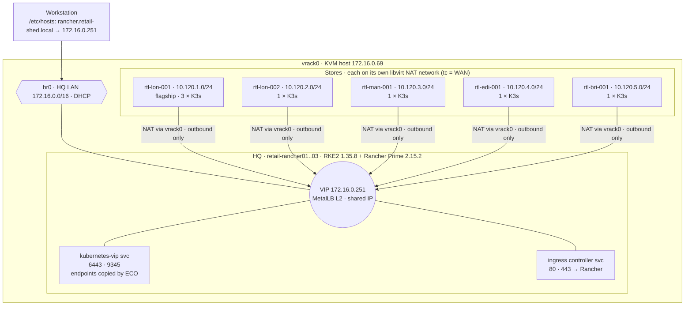

# retail-shed — SUSE Edge retail lab on vrack0

A retail estate in miniature, built on what worked in `hypothetical-K8S-environment`
(demo-shed). **HQ** is a 3-node HA Rancher Prime with no load-balancer VMs: its VIP
is held inside the cluster by MetalLB and Endpoint Copier Operator, the SUSE Edge pattern. **Stores** are K3s clusters on SL Micro 6.2 boxes that are "shipped"
with one generic image and **enrol themselves** at first boot. Each store sits on
its own isolated LAN behind a simulated WAN link.

## Topology



| Role | Hosts | Image | vCPU / RAM / disk | Network |
|---|---|---|---|---|
| Rancher Prime (RKE2 `local`) | retail-rancher01..03 | `rancher/retail-rancher.iso` | 4 / 16 GB / 64 GB | br0, DHCP |
| Store box | store-`<store>`-n`<N>` | `store/retail-store.iso` (one image for all) | 4 / 8 GB / 64 GB | rtl-`<store>`, fixed 10.120.`<net>`.1`<N>` |

`stores.txt` lists the stores (region, tier, LAN number); `nodes.txt` lists every VM
with its MAC and network. HQ addresses come from DHCP; `discover-ips.sh` writes them
to `hosts.txt`. Store addresses are fixed by the store router's DHCP reservations.

| Store | Region | Tier | Nodes | LAN |
|---|---|---|---|---|
| lon-001 | london | flagship | 3 (HA etcd) | 10.120.1.0/24 |
| lon-002 | london | standard | 1 | 10.120.2.0/24 |
| man-001 | manchester | standard | 1 | 10.120.3.0/24 |
| edi-001 | edinburgh | standard | 1 | 10.120.4.0/24 |
| bri-001 | bristol | standard | 1 | 10.120.5.0/24 |

## How a store box onboards

1. **HQ creates the store record.** `setup-stores.sh` makes an empty K3s custom cluster
   `store-<store>` in Rancher, labelled `retail.lab/store`, `retail.lab/region` and
   `retail.lab/tier`. These are the labels Fleet will target.
2. **The box is generic.** Every store box boots the same `retail-store.iso`. The box's
   identity is its SMBIOS serial (`store-man-001-n1`), which `create-vms.sh` sets to the VM name.
   On real hardware it would be the chassis serial mapped in an asset database.
3. **First boot.** `retail-enrol.service` (from `eib/store/custom/files`):
   - names the host after its serial;
   - waits for HQ's `store-<store>` cluster;
   - reads that cluster's registration command and runs it with all roles plus the label
     `retail.lab/store`. If the record doesn't exist yet, or the WAN is down, it keeps retrying.
4. **Verified, not insecure.** `make-pki.sh` creates an HQ CA that signs Rancher's
   certificate. Rancher runs with `privateCA: true`, and the store image trusts the CA. So
   boxes use Rancher's verified registration command with a CA checksum, unlike demo-shed's
   `--insecure` one.
5. **Enrolment credential.** The image holds a Rancher API token for the user `store-enrol`. Its
   global role can only `get/list` provisioning clusters and cluster registration tokens.
   Anyone who extracts it from an image can enrol a rogue node into a store cluster, which is
   acceptable for a lab. In production, use Elemental with TPM attestation, or a short-lived
   per-batch token.

## HQ VIP without load balancers

`setup-rancher.sh` follows the SUSE Edge HA control-plane pattern:

1. retail-rancher01 starts RKE2 alone. Its `tls-san` already includes the VIP and the Rancher name.
2. The SUSE Edge charts **MetalLB** (`307.0.3+up0.16.1`) and **Endpoint Copier Operator**
   (`307.0.1+up0.3.0`) are installed from `oci://registry.suse.com/edge/charts`.
3. MetalLB gets a one-address pool `hq-vip` (`172.16.0.251/32`, `autoAssign: false`) and
   announces it in L2 mode on `enp1s0`. Services ask for the VIP by annotation.
4. The `default/kubernetes-vip` service (LoadBalancer, 6443 + 9345) has no selector. ECO copies
   the `kubernetes` service's endpoints into it, so the VIP always reaches every live apiserver
   and RKE2 supervisor.
5. retail-rancher02/03 join through `https://172.16.0.251:9345`.
6. The RKE2 ingress controller's service becomes a LoadBalancer on the **same** IP
   (`metallb.io/allow-shared-ip: retail-hq-vip`), so ports 80 and 443 for Rancher are on the VIP too.

If the node announcing the VIP dies, MetalLB moves the announcement to another node within
seconds (gratuitous ARP). Kubernetes services don't answer ping on a LoadBalancer IP, so check
the VIP with `curl -k https://172.16.0.251:6443/`, not `ping`.

## Store networks and the WAN

- Each store is a libvirt NAT network (`create-networks.sh`) on bridge `rtl-<store>`.
  libvirt's dnsmasq at `.1` is the store router:
  - it gives out fixed addresses by MAC;
  - it answers `rancher.retail-shed.local` with the HQ VIP, so store nodes and their CoreDNS
    need no hosts-file tricks.
- Store traffic leaves through NAT on vrack0. Stores can reach HQ but not each other, and
  nothing can connect into a store. That's fine, because Rancher and Fleet agents only dial out.
- To reach a store node, jump through vrack0: `ssh -J root@172.16.0.69 root@10.120.3.11`.
- `wan.sh` shapes the HQ→store direction on the store bridge. That direction carries every
  reply a store gets, so it affects round trips. Traffic inside the store LAN and the
  router's ARP/DHCP/DNS are never shaped, so a WAN outage leaves the store LAN running.

```bash
./wan.sh status
./wan.sh degrade man-001 120 1 10mbit   # 120 ms (±12), 1 % loss, 10 Mbit/s
./wan.sh outage edi-001                  # store disconnected from HQ
./wan.sh restore all
```

## Build order

```bash
# 0. Secrets (same format as demo-shed): eib/secrets.env holds the SCC code + root hash
./make-pki.sh                    # HQ CA + Rancher certificate in pki/ (once)
./fetch-rpms.sh                  # pinned, signature-checked RKE2 / k3s-selinux RPMs
./render-eib.sh rancher
./build-images.sh rancher        # rsync eib/rancher to vrack0, EIB builds the ISO there

# 1. HQ
./create-vms.sh rancher
./discover-ips.sh                # once all 3 answer on br0 → hosts.txt
./setup-rancher.sh               # RKE2 ×3, MetalLB/ECO VIP, cert-manager, Rancher

# 2. Store image (needs Rancher: the enrolment token is baked in)
./setup-stores.sh --enrol-only   # store-enrol role/user/token → credentials.env
./render-eib.sh store
./build-images.sh store

# 3. Stores
./create-networks.sh             # rtl-<store> networks (done before step 1 is fine)
./setup-stores.sh                # store records in Rancher
./create-vms.sh store            # boxes install, boot, enrol themselves
```

Day 2:

- `./shutdown-platform.sh` takes an etcd snapshot, then powers off the stores, then Rancher.
- `./startup-platform.sh` powers on in the reverse order.
- `./cleanup-platform.sh [rancher|store|networks|<store>]` deletes VMs and their disks. When
  stores are removed but Rancher is kept, their clusters are deleted in Rancher too; run
  `setup-stores.sh` before re-creating them.
- To add a store, add a line to `stores.txt` and its nodes to `nodes.txt`, then run
  `create-networks.sh`, `setup-stores.sh <store>` and `create-vms.sh <node>`.
  The image needs no rebuild.

## Access

- UI: https://rancher.retail-shed.local, user `admin`, password
  `RANCHER_BOOTSTRAP_PASSWORD` in `credentials.env` (gitignored)
- The workstation needs `172.16.0.251 rancher.retail-shed.local` in `/etc/hosts`. To skip
  browser warnings, trust `pki/ca.pem`.
- Rancher cluster kubeconfig: `/etc/rancher/rke2/rke2.yaml` on retail-rancher01

## Versions

- SL Micro 6.2 (Default self-install ISO) built with Edge Image Builder 1.3.1
- HQ: RKE2 v1.35.8+rke2r1 (side-loaded RPMs), Rancher Prime 2.15.2, cert-manager v1.21.2,
  MetalLB 0.16.1 and Endpoint Copier Operator 0.3.0 (SUSE Edge 3.7 charts)
- Stores: the newest K3s v1.35 that Rancher offers (`setup-stores.sh`; override with `K3S_VERSION`),
  `k3s-selinux` 1.6 side-loaded into the image

## Notes and gotchas (carried over from demo-shed / hf-shed)

- **Side-loaded RPMs, not rpm.rancher.io repos.** `fetch-rpms.sh` downloads the RPMs, and EIB
  checks each one against `rpms/gpg-keys`. There are two reasons:
  - The K3s SL Micro repo has unsigned metadata.
  - On 2026-10-01, Cloudflare served a stale cached `repomd.xml` for the RKE2 1.35 repo next
    to the fresh signature for v1.35.9, so EIB refused the repo with "Signature verification
    failed".
- **One EIB directory per image** (`eib/rancher`, `eib/store`). EIB installs every RPM in a
  directory's `rpms/` into every image built from that directory.
- **Self-installer.** The SL Micro self-installer never powers off; it installs and boots into
  the OS. `create-vms.sh` then removes the ISO from the saved VM config and sets
  `on_reboot=restart`. That config takes effect at the VM's next cold boot.
- **SELinux** is enforcing everywhere.
- **No DNS zone on the HQ LAN.** HQ nodes get `rancher.retail-shed.local` from `/etc/hosts`
  (EIB script `02-hosts.sh`). Store nodes get it from their store router.
- **Images and the enrolment token.** Rebuilding Rancher invalidates the enrolment token, so
  the store image must be re-rendered and rebuilt after a Rancher rebuild.
- **Coexistence.** demo-shed and hf-shed are not running. retail-shed uses VIP .251, so it can
  coexist with demo-shed (.252) on br0.

## Next phase

Retail demo apps (POS, inventory, pricing) delivered with Fleet GitOps to the
store clusters, targeted with the `retail.lab/*` labels (e.g. flagship-only services,
regional price lists).
